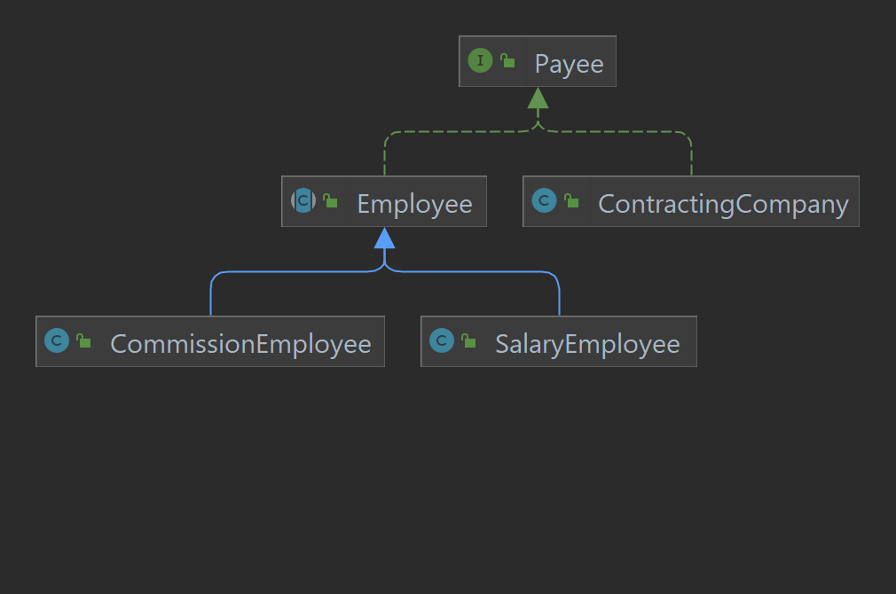

# java-abstraction-project
This is just basic implementation of payment system for a fictive company.

## How to build (JDK 11 needed)
mvn package

## How to run
java -cp target/java-abstraction-project-1.0-SNAPSHOT.jar com.example.paymentsystem.MainApp

### Class diagram for the project

